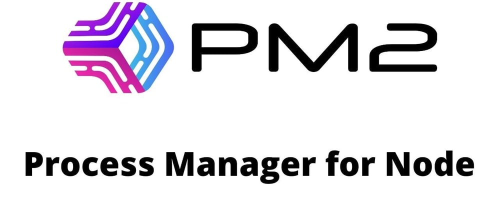

# PM2 Kurulumu

***

<figure><figcaption></figcaption></figure>

#### 1. **Node.js ve npm Kurulumu**

**PM2**, Node.js üzerinde çalışır. İlk olarak, Node.js'i yükleyin:

**Node.js Deposu Eklemek:**

```bash
curl -fsSL https://rpm.nodesource.com/setup_18.x | sudo bash -
```

> Not: "18.x" yerine ihtiyaçlarınıza uygun Node.js sürümünü belirtebilirsiniz.

**Node.js ve npm Yüklemek:**

```bash
sudo yum install nodejs -y
```

Sürümü kontrol ederek kurulumun doğru yapıldığını doğrulayın:

```bash
node -v
npm -v
```

***

#### 2. **PM2'yi Global Olarak Kurun**

PM2'yi yüklemek için `npm` kullanın:

```bash
sudo npm install -g pm2
```

PM2'nin kurulu olduğunu doğrulamak için:

```bash
pm2 -v
```

***

#### 3. **Bir Node.js Uygulamasını PM2 ile Başlatma**

Bir test uygulaması çalıştırarak PM2'yi doğrulayabilirsiniz:

**Örnek Node.js Uygulaması:**

```bash
echo "const http = require('http'); 
const server = http.createServer((req, res) => {
  res.end('Hello World');
}); 
server.listen(3000);" > app.js
```

**PM2 ile Uygulamayı Başlatma:**

```bash
pm2 start app.js
```

***

#### 4. **PM2'yi Sistem Başlangıcına Ekleme**

PM2'nin sistem yeniden başlatıldığında uygulamalarınızı otomatik olarak başlatmasını sağlamak için:

```bash
pm2 startup
```

Komutun çıktısında yer alan komutu çalıştırarak hizmeti etkinleştirin.

**Tüm Süreçleri Kaydedin:**

```bash
pm2 save
```

***

#### 5. **PM2 Durumu İzleme**

PM2 ile çalışan süreçleri kontrol etmek için:

```bash
pm2 list
```

***

#### 6. **PM2 Loglarını İzleme**

Uygulama günlüklerini izlemek için:

```bash
pm2 logs
```

***

#### 7. **PM2'yi Kaldırma (Gerekirse)**

PM2'yi kaldırmak isterseniz:

```bash
sudo npm uninstall -g pm2
```
